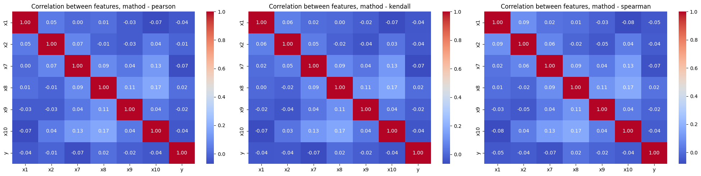
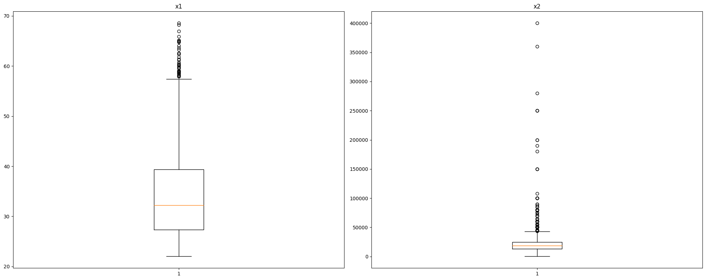
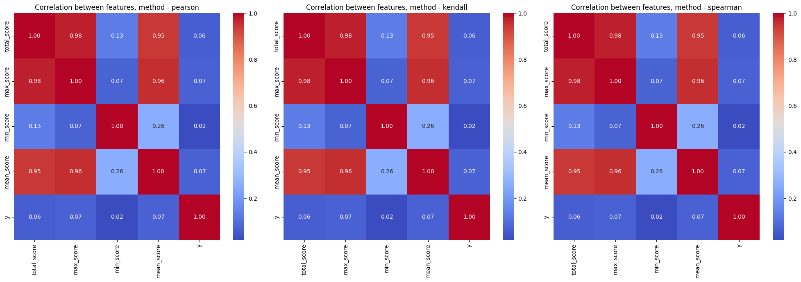

# Credit scoring

The process of creating a credit scoring model.
To create the model I used the following process:
- exploratory data analysis, drew up a rough action plan
- filled in missing values in features, identified new features from the date, processed categorical features
- scaled the features using Standard Scaler
- splitted the dataset into training and test samples, taking into account class imbalance
- created and launched tracking metrics and model parameters using MLFlow
- compared LogisticRegression, RandomForestClassifier, CatboostClassifier


```python
import json
import pandas as pd
import matplotlib.pyplot as plt
import seaborn as sns

import mlflow
from mlflow.tracking import MlflowClient

from sklearn.linear_model import LogisticRegression
from sklearn.ensemble import RandomForestClassifier
from sklearn.pipeline import Pipeline
from sklearn.preprocessing import StandardScaler
from sklearn.model_selection import train_test_split

from sklearn.metrics import roc_auc_score

from catboost import CatBoostClassifier

%matplotlib inline
```


```python
mlflow.set_tracking_uri("sqlite:///mlflow.db")
mlflow.set_experiment("Credit_Scoring")
```


    <Experiment: artifact_location='/Users/nikitaefremov/Documents/DATA_SCIENCE/Credit_Scoring/notebooks/mlruns/3', creation_time=1713111825585, experiment_id='3', last_update_time=1713111825585, lifecycle_stage='active', name='Credit_Scoring', tags={}>


____


```python
df = pd.read_excel('../data/text_data_model.xlsx')
```

## EDA


```python
df.describe(include='object')
```


<div>
<style scoped>
    .dataframe tbody tr th:only-of-type {
        vertical-align: middle;
    }

    .dataframe tbody tr th {
        vertical-align: top;
    }

    .dataframe thead th {
        text-align: right;
    }
</style>
<table border="1" class="dataframe">
  <thead>
    <tr style="text-align: right;">
      <th></th>
      <th>id</th>
      <th>x3</th>
      <th>x4</th>
      <th>x5</th>
      <th>x6</th>
      <th>x11</th>
    </tr>
  </thead>
  <tbody>
    <tr>
      <th>count</th>
      <td>2000</td>
      <td>1987</td>
      <td>2000</td>
      <td>2000</td>
      <td>34</td>
      <td>2000</td>
    </tr>
    <tr>
      <th>unique</th>
      <td>2000</td>
      <td>6</td>
      <td>11</td>
      <td>2000</td>
      <td>34</td>
      <td>127</td>
    </tr>
    <tr>
      <th>top</th>
      <td>7ED6CC5B-6628-4873-9D4C-33455B29CC4C</td>
      <td>Android</td>
      <td>UMID</td>
      <td>*******ynordemaala1985@gmail.com</td>
      <td>+6390627*****</td>
      <td>[{"id": "E115", "name": "Domain is a free prov...</td>
    </tr>
    <tr>
      <th>freq</th>
      <td>1</td>
      <td>1783</td>
      <td>491</td>
      <td>1</td>
      <td>1</td>
      <td>810</td>
    </tr>
  </tbody>
</table>
</div>


```python
df.describe(include='number')
```


<div>
<style scoped>
    .dataframe tbody tr th:only-of-type {
        vertical-align: middle;
    }

    .dataframe tbody tr th {
        vertical-align: top;
    }

    .dataframe thead th {
        text-align: right;
    }
</style>
<table border="1" class="dataframe">
  <thead>
    <tr style="text-align: right;">
      <th></th>
      <th>x1</th>
      <th>x2</th>
      <th>x7</th>
      <th>x8</th>
      <th>x9</th>
      <th>x10</th>
      <th>y</th>
    </tr>
  </thead>
  <tbody>
    <tr>
      <th>count</th>
      <td>2000.000000</td>
      <td>1976.000000</td>
      <td>1953.000000</td>
      <td>1943.000000</td>
      <td>1982.000000</td>
      <td>1943.000000</td>
      <td>2000.000000</td>
    </tr>
    <tr>
      <th>mean</th>
      <td>34.251812</td>
      <td>22141.979757</td>
      <td>0.292883</td>
      <td>0.854864</td>
      <td>0.838042</td>
      <td>0.316006</td>
      <td>0.352000</td>
    </tr>
    <tr>
      <th>std</th>
      <td>8.953549</td>
      <td>22189.029628</td>
      <td>0.455202</td>
      <td>0.352329</td>
      <td>0.368505</td>
      <td>0.465035</td>
      <td>0.477713</td>
    </tr>
    <tr>
      <th>min</th>
      <td>22.015058</td>
      <td>250.000000</td>
      <td>0.000000</td>
      <td>0.000000</td>
      <td>0.000000</td>
      <td>0.000000</td>
      <td>0.000000</td>
    </tr>
    <tr>
      <th>25%</th>
      <td>27.338125</td>
      <td>13000.000000</td>
      <td>0.000000</td>
      <td>1.000000</td>
      <td>1.000000</td>
      <td>0.000000</td>
      <td>0.000000</td>
    </tr>
    <tr>
      <th>50%</th>
      <td>32.243669</td>
      <td>18500.000000</td>
      <td>0.000000</td>
      <td>1.000000</td>
      <td>1.000000</td>
      <td>0.000000</td>
      <td>0.000000</td>
    </tr>
    <tr>
      <th>75%</th>
      <td>39.380561</td>
      <td>25000.000000</td>
      <td>1.000000</td>
      <td>1.000000</td>
      <td>1.000000</td>
      <td>1.000000</td>
      <td>1.000000</td>
    </tr>
    <tr>
      <th>max</th>
      <td>68.553046</td>
      <td>400000.000000</td>
      <td>1.000000</td>
      <td>1.000000</td>
      <td>1.000000</td>
      <td>1.000000</td>
      <td>1.000000</td>
    </tr>
  </tbody>
</table>
</div>


### TODO:

Categorical: \
id - delete \
x3 - to one hot encoding, only 6 values \
x4 - 11 values, one hot encoding or mean target encoding \
x5 - email, delete \
x6 - only 34 values. Delete or create binary feature \
x11 - a lot unique values - 127. Parse JSON and look what is inside

Numerical: \
x1 - there is no missing values \
x2 - income? there is a few missing values \
x7 - binary column, 47 missing values \
x8 - binary column, 57 missing values \
x9 - binary column, 18 missing values \
x10 - binary column, 57 missing values \
y - target, there is no missing values 

Data: \
dt - data, get year, month, day of week

### Correlation between features


```python
# Use 3 methods of correlation
methods = ['pearson', 'kendall', 'spearman']

fig, axes = plt.subplots(1, 3, figsize=(20, 5))

for idx, method in enumerate(methods):
    corr_matrix = df[df.describe(include='number').columns].corr(method=method)
    sns.heatmap(corr_matrix, ax=axes[idx], annot=True, fmt=".2f", cmap='coolwarm')
    axes[idx].set_title(f'Correlation between features, mathod - {method}')


plt.tight_layout() 
plt.show()
```


    

    


There is no valuable correlation between features


```python
df['y'].value_counts()
```


    y
    0    1296
    1     704
    Name: count, dtype: int64


There is a slight class imbalance

____

## Feature Engineering


```python
# Delete index, email and phone numbers
df = df.drop(['id', 'x5', 'x6'], axis=1)
```


```python
# Get month and day of week
df['month'] = df['dt'].dt.month
df['day_of_week'] = df['dt'].dt.day_of_week

df = df.drop('dt', axis=1)
```


```python
# Fill missing values in x2 with median
# TODO: try mean, mode

df['x2'] = df['x2'].fillna(df.x2.median())
```

### Emissions


```python
fig, axes = plt.subplots(1, 2, figsize=(20, 8))

num_cols = ['x1', 'x2']
for idx, col in enumerate(num_cols):
    axes[idx].boxplot(df[col]) 
    axes[idx].set_title(f'{col}')

plt.tight_layout()
plt.show()    
```


    

    


There is no valuable emmisions in x1. \
Delete rows where values of x2 > 200000 for improving accuracy of models


```python
df = df[df['x2'] < 200000]
```


```python
# Fill the missing values in binary columns with mode and convert them to int type

cols = ['x7', 'x8', 'x9', 'x10']

for col in cols:
    mode_value = df[col].mode()[0]
    df[col] = df[col].fillna(mode_value).astype(int)
```


```python
# Fill the missing values in categorical columns with mode
cat_cols = ['x3', 'x4']

for col in cat_cols:
    mode_value = df[col].mode()[0]
    df[col] = df[col].fillna(mode_value)
```


```python
# Control check for missing values
df.isna().sum()
```


    x1             0
    x2             0
    x3             0
    x4             0
    x7             0
    x8             0
    x9             0
    x10            0
    x11            0
    y              0
    month          0
    day_of_week    0
    dtype: int64


#### Parse JSON


```python
def safe_json_loads(s):
    try:
        return json.loads(s)
    except ValueError:
        return None 

df['x11'] = df['x11'].apply(safe_json_loads)
```


```python
def calculate_score_stats(dicts):
    scores = [d.get('score') for d in dicts if 'score' in d]
    if not scores: 
        return {'total_score': None, 'max_score': None, 'min_score': None}
    total_score = sum(scores)
    max_score = max(scores)
    min_score = min(scores)
    mean_score = sum(scores) / len(scores)
    return {'total_score': total_score, 'max_score': max_score, 'min_score': min_score, 'mean_score': mean_score}
```


```python
new_features_df = pd.DataFrame()
```


```python
new_features_df[['total_score', 'max_score', 'min_score', 'mean_score']] = df['x11'].apply(lambda x: pd.Series(calculate_score_stats(x)))
```


```python
new_features_df.head()
```


<div>
<style scoped>
    .dataframe tbody tr th:only-of-type {
        vertical-align: middle;
    }

    .dataframe tbody tr th {
        vertical-align: top;
    }

    .dataframe thead th {
        text-align: right;
    }
</style>
<table border="1" class="dataframe">
  <thead>
    <tr style="text-align: right;">
      <th></th>
      <th>total_score</th>
      <th>max_score</th>
      <th>min_score</th>
      <th>mean_score</th>
    </tr>
  </thead>
  <tbody>
    <tr>
      <th>0</th>
      <td>1.0</td>
      <td>1.0</td>
      <td>0.0</td>
      <td>0.5</td>
    </tr>
    <tr>
      <th>1</th>
      <td>1.0</td>
      <td>1.0</td>
      <td>0.0</td>
      <td>0.5</td>
    </tr>
    <tr>
      <th>2</th>
      <td>1.0</td>
      <td>1.0</td>
      <td>0.0</td>
      <td>0.5</td>
    </tr>
    <tr>
      <th>3</th>
      <td>1.0</td>
      <td>1.0</td>
      <td>0.0</td>
      <td>0.5</td>
    </tr>
    <tr>
      <th>4</th>
      <td>3.0</td>
      <td>2.0</td>
      <td>0.0</td>
      <td>1.0</td>
    </tr>
  </tbody>
</table>
</div>


```python
df = df.drop('x11', axis=1)
df = pd.concat([df, new_features_df], axis=1)
```

#### Correlation of new features between themselves and the target variable


```python
methods = ['pearson', 'kendall', 'spearman']

fig, axes = plt.subplots(1, 3, figsize=(20, 7))

for idx, method in enumerate(methods):
    score_corr_matrix = df[['total_score', 'max_score', 'min_score', 'mean_score', 'y']].corr()
    sns.heatmap(score_corr_matrix, ax=axes[idx], annot=True, fmt=".2f", cmap='coolwarm')
    axes[idx].set_title(f'Correlation between features, method - {method}')


plt.tight_layout() 
plt.show()
```


    

    


There is no obvious correlation between the traits and the target variable, but there is a strong correlation between each other.

To train the model we will use max_score and min_score


```python
df.drop(['total_score', 'mean_score'], axis=1, inplace=True)
```

#### One Hot Encoding


```python
# Copy dataframe to use processing of categorical features in Catboost
df_for_cat = df.copy()
```


```python
ohe_cols = ['x3', 'x4']
```


```python
df = pd.get_dummies(df, columns=ohe_cols, dtype=int)
```

____

## Scaler


```python
scaler = StandardScaler()
```


```python
numerical_features_df = [i for i in df.describe(include='number').columns]

numerical_features_df_cf = [i for i in df_for_cat.describe(include='number')]
```


```python
numerical_features_df.remove('y')
numerical_features_df_cf.remove('y')
```


```python
df[numerical_features_df] = scaler.fit_transform(df[numerical_features_df])
df_for_cat[numerical_features_df_cf] = scaler.fit_transform(df_for_cat[numerical_features_df_cf])
```

___


```python
df.head()
```


<div>
<style scoped>
    .dataframe tbody tr th:only-of-type {
        vertical-align: middle;
    }

    .dataframe tbody tr th {
        vertical-align: top;
    }

    .dataframe thead th {
        text-align: right;
    }
</style>
<table border="1" class="dataframe">
  <thead>
    <tr style="text-align: right;">
      <th></th>
      <th>x1</th>
      <th>x2</th>
      <th>x7</th>
      <th>x8</th>
      <th>x9</th>
      <th>x10</th>
      <th>y</th>
      <th>month</th>
      <th>day_of_week</th>
      <th>max_score</th>
      <th>...</th>
      <th>x4_7</th>
      <th>x4_18</th>
      <th>x4_20</th>
      <th>x4_21</th>
      <th>x4_Driver license ID</th>
      <th>x4_PRC</th>
      <th>x4_Passport</th>
      <th>x4_SSS</th>
      <th>x4_TIN</th>
      <th>x4_UMID</th>
    </tr>
  </thead>
  <tbody>
    <tr>
      <th>0</th>
      <td>0.306617</td>
      <td>0.198673</td>
      <td>1.581417</td>
      <td>0.405255</td>
      <td>0.437479</td>
      <td>1.503406</td>
      <td>0</td>
      <td>0.723948</td>
      <td>-1.014434</td>
      <td>-0.373272</td>
      <td>...</td>
      <td>-0.265315</td>
      <td>-0.050163</td>
      <td>-0.119401</td>
      <td>-0.174707</td>
      <td>2.007561</td>
      <td>-0.166924</td>
      <td>-0.3171</td>
      <td>-0.239426</td>
      <td>-0.411947</td>
      <td>-0.569621</td>
    </tr>
    <tr>
      <th>1</th>
      <td>-0.778712</td>
      <td>-0.347062</td>
      <td>-0.632344</td>
      <td>0.405255</td>
      <td>0.437479</td>
      <td>-0.665156</td>
      <td>0</td>
      <td>0.723948</td>
      <td>-1.014434</td>
      <td>-0.373272</td>
      <td>...</td>
      <td>-0.265315</td>
      <td>-0.050163</td>
      <td>-0.119401</td>
      <td>-0.174707</td>
      <td>2.007561</td>
      <td>-0.166924</td>
      <td>-0.3171</td>
      <td>-0.239426</td>
      <td>-0.411947</td>
      <td>-0.569621</td>
    </tr>
    <tr>
      <th>2</th>
      <td>-0.797361</td>
      <td>0.266890</td>
      <td>-0.632344</td>
      <td>0.405255</td>
      <td>0.437479</td>
      <td>1.503406</td>
      <td>1</td>
      <td>0.723948</td>
      <td>-0.290669</td>
      <td>-0.373272</td>
      <td>...</td>
      <td>-0.265315</td>
      <td>-0.050163</td>
      <td>-0.119401</td>
      <td>-0.174707</td>
      <td>-0.498117</td>
      <td>-0.166924</td>
      <td>-0.3171</td>
      <td>-0.239426</td>
      <td>2.427495</td>
      <td>-0.569621</td>
    </tr>
    <tr>
      <th>3</th>
      <td>-0.316759</td>
      <td>0.607974</td>
      <td>-0.632344</td>
      <td>0.405255</td>
      <td>0.437479</td>
      <td>-0.665156</td>
      <td>1</td>
      <td>0.723948</td>
      <td>-0.290669</td>
      <td>-0.373272</td>
      <td>...</td>
      <td>-0.265315</td>
      <td>-0.050163</td>
      <td>-0.119401</td>
      <td>-0.174707</td>
      <td>-0.498117</td>
      <td>-0.166924</td>
      <td>-0.3171</td>
      <td>-0.239426</td>
      <td>-0.411947</td>
      <td>1.755553</td>
    </tr>
    <tr>
      <th>4</th>
      <td>0.128378</td>
      <td>0.607974</td>
      <td>1.581417</td>
      <td>0.405255</td>
      <td>-2.285826</td>
      <td>-0.665156</td>
      <td>1</td>
      <td>0.723948</td>
      <td>-1.014434</td>
      <td>0.015822</td>
      <td>...</td>
      <td>-0.265315</td>
      <td>-0.050163</td>
      <td>-0.119401</td>
      <td>-0.174707</td>
      <td>-0.498117</td>
      <td>-0.166924</td>
      <td>-0.3171</td>
      <td>-0.239426</td>
      <td>-0.411947</td>
      <td>-0.569621</td>
    </tr>
  </tbody>
</table>
<p>5 rows × 28 columns</p>
</div>


```python
df_for_cat.head()
```


<div>
<style scoped>
    .dataframe tbody tr th:only-of-type {
        vertical-align: middle;
    }

    .dataframe tbody tr th {
        vertical-align: top;
    }

    .dataframe thead th {
        text-align: right;
    }
</style>
<table border="1" class="dataframe">
  <thead>
    <tr style="text-align: right;">
      <th></th>
      <th>x1</th>
      <th>x2</th>
      <th>x3</th>
      <th>x4</th>
      <th>x7</th>
      <th>x8</th>
      <th>x9</th>
      <th>x10</th>
      <th>y</th>
      <th>month</th>
      <th>day_of_week</th>
      <th>max_score</th>
      <th>min_score</th>
    </tr>
  </thead>
  <tbody>
    <tr>
      <th>0</th>
      <td>0.306617</td>
      <td>0.198673</td>
      <td>Android</td>
      <td>Driver license ID</td>
      <td>1.581417</td>
      <td>0.405255</td>
      <td>0.437479</td>
      <td>1.503406</td>
      <td>0</td>
      <td>0.723948</td>
      <td>-1.014434</td>
      <td>-0.373272</td>
      <td>-0.212474</td>
    </tr>
    <tr>
      <th>1</th>
      <td>-0.778712</td>
      <td>-0.347062</td>
      <td>Android</td>
      <td>Driver license ID</td>
      <td>-0.632344</td>
      <td>0.405255</td>
      <td>0.437479</td>
      <td>-0.665156</td>
      <td>0</td>
      <td>0.723948</td>
      <td>-1.014434</td>
      <td>-0.373272</td>
      <td>-0.212474</td>
    </tr>
    <tr>
      <th>2</th>
      <td>-0.797361</td>
      <td>0.266890</td>
      <td>Android</td>
      <td>TIN</td>
      <td>-0.632344</td>
      <td>0.405255</td>
      <td>0.437479</td>
      <td>1.503406</td>
      <td>1</td>
      <td>0.723948</td>
      <td>-0.290669</td>
      <td>-0.373272</td>
      <td>-0.212474</td>
    </tr>
    <tr>
      <th>3</th>
      <td>-0.316759</td>
      <td>0.607974</td>
      <td>Android</td>
      <td>UMID</td>
      <td>-0.632344</td>
      <td>0.405255</td>
      <td>0.437479</td>
      <td>-0.665156</td>
      <td>1</td>
      <td>0.723948</td>
      <td>-0.290669</td>
      <td>-0.373272</td>
      <td>-0.212474</td>
    </tr>
    <tr>
      <th>4</th>
      <td>0.128378</td>
      <td>0.607974</td>
      <td>Android</td>
      <td>4</td>
      <td>1.581417</td>
      <td>0.405255</td>
      <td>-2.285826</td>
      <td>-0.665156</td>
      <td>1</td>
      <td>0.723948</td>
      <td>-1.014434</td>
      <td>0.015822</td>
      <td>-0.212474</td>
    </tr>
  </tbody>
</table>
</div>


___

## Train test split


```python
X = df.drop('y', axis=1)
y = df['y']
```


```python
X_train, X_test, y_train, y_test = train_test_split(X, y, test_size=0.2, random_state=42, stratify=y)
```

## Logistic Regression


```python
with mlflow.start_run():

    # Initialize parameters
    params = {
        'max_iter': 1000,
        'penalty': 'l1',
        'solver': 'liblinear'
    }

    # Log model name and parameters
    mlflow.set_tag('model_name', 'Logistic_Regression')
    mlflow.log_params(params)

    # Train the model
    model = LogisticRegression(**params)
    model.fit(X_train, y_train)

    # Predict
    y_hat_train = model.predict_proba(X_train)[:, 1]
    y_hat_test = model.predict_proba(X_test)[:, 1]
    
    # Get metrics
    roc_auc_train = roc_auc_score(y_train, y_hat_train)
    gini_train = 2 * roc_auc_train - 1
    roc_auc_test = roc_auc_score(y_test, y_hat_test) 
    gini_test = 2 * roc_auc_test - 1

    # Log metrics and model
    mlflow.log_metric('gini_train', gini_train)
    mlflow.log_metric('gini_test', gini_test)
    mlflow.sklearn.log_model(model, 'sk_models')
```

## Random Forest


```python
with mlflow.start_run():

    # Initialize parameters
    params = {
        'n_estimators': 100,
        'max_depth': 100,
        'min_samples_split': 10,
        'min_samples_leaf': 4,
        'criterion': 'gini'
    }

    # Log model name and parameters
    mlflow.set_tag('model_name', 'RandomForestClassifier')
    mlflow.log_params(params)

    # Train the model
    model = RandomForestClassifier(**params)
    model.fit(X_train, y_train)

    # Predict
    y_hat_train = model.predict_proba(X_train)[:, 1]
    y_hat_test = model.predict_proba(X_test)[:, 1]
    
    # Get metrics
    roc_auc_train = roc_auc_score(y_train, y_hat_train)
    gini_train = 2 * roc_auc_train - 1
    roc_auc_test = roc_auc_score(y_test, y_hat_test)
    gini_test = 2 * roc_auc_test - 1

    # Log metrics and model
    mlflow.log_metric('gini_train', gini_train)
    mlflow.log_metric('gini_test', gini_test)
    mlflow.sklearn.log_model(model, 'RF_models')
```

    /Library/Frameworks/Python.framework/Versions/3.11/lib/python3.11/site-packages/_distutils_hack/__init__.py:18: UserWarning: Distutils was imported before Setuptools, but importing Setuptools also replaces the `distutils` module in `sys.modules`. This may lead to undesirable behaviors or errors. To avoid these issues, avoid using distutils directly, ensure that setuptools is installed in the traditional way (e.g. not an editable install), and/or make sure that setuptools is always imported before distutils.
      warnings.warn(
    /Library/Frameworks/Python.framework/Versions/3.11/lib/python3.11/site-packages/_distutils_hack/__init__.py:33: UserWarning: Setuptools is replacing distutils.
      warnings.warn("Setuptools is replacing distutils.")


## CatBoost


```python
with mlflow.start_run():

    # Initialize parameters
    params = {
        'iterations': 1000,
        'learning_rate': 0.01,
        'depth': 5,
        'cat_features': None,
        'verbose': 0
    }

    # Log model name and parameters
    mlflow.set_tag('model_name', 'CatBoostClassifier')
    mlflow.log_params(params)

    # Train the model
    # model = CatBoostClassifier(verbose=0)
    model = CatBoostClassifier(**params)
    model.fit(X_train, y_train)

    # Predict
    y_hat_train = model.predict_proba(X_train)[:, 1]
    y_hat_test = model.predict_proba(X_test)[:, 1]
    
    # Get metrics
    roc_auc_train = roc_auc_score(y_train, y_hat_train)
    gini_train = 2 * roc_auc_train - 1
    roc_auc_test = roc_auc_score(y_test, y_hat_test)
    gini_test = 2 * roc_auc_test - 1

    # Log metrics and model
    mlflow.log_metric('gini_train', gini_train)
    mlflow.log_metric('gini_test', gini_test)
    mlflow.catboost.log_model(model, 'CB_models')
```

    /Library/Frameworks/Python.framework/Versions/3.11/lib/python3.11/site-packages/_distutils_hack/__init__.py:18: UserWarning: Distutils was imported before Setuptools, but importing Setuptools also replaces the `distutils` module in `sys.modules`. This may lead to undesirable behaviors or errors. To avoid these issues, avoid using distutils directly, ensure that setuptools is installed in the traditional way (e.g. not an editable install), and/or make sure that setuptools is always imported before distutils.
      warnings.warn(
    /Library/Frameworks/Python.framework/Versions/3.11/lib/python3.11/site-packages/_distutils_hack/__init__.py:33: UserWarning: Setuptools is replacing distutils.
      warnings.warn("Setuptools is replacing distutils.")


## Catboost, batch categorical features


```python
df_for_cat.head()
```


<div>
<style scoped>
    .dataframe tbody tr th:only-of-type {
        vertical-align: middle;
    }

    .dataframe tbody tr th {
        vertical-align: top;
    }

    .dataframe thead th {
        text-align: right;
    }
</style>
<table border="1" class="dataframe">
  <thead>
    <tr style="text-align: right;">
      <th></th>
      <th>x1</th>
      <th>x2</th>
      <th>x3</th>
      <th>x4</th>
      <th>x7</th>
      <th>x8</th>
      <th>x9</th>
      <th>x10</th>
      <th>y</th>
      <th>month</th>
      <th>day_of_week</th>
      <th>max_score</th>
      <th>min_score</th>
    </tr>
  </thead>
  <tbody>
    <tr>
      <th>0</th>
      <td>0.306617</td>
      <td>0.198673</td>
      <td>Android</td>
      <td>Driver license ID</td>
      <td>1.581417</td>
      <td>0.405255</td>
      <td>0.437479</td>
      <td>1.503406</td>
      <td>0</td>
      <td>0.723948</td>
      <td>-1.014434</td>
      <td>-0.373272</td>
      <td>-0.212474</td>
    </tr>
    <tr>
      <th>1</th>
      <td>-0.778712</td>
      <td>-0.347062</td>
      <td>Android</td>
      <td>Driver license ID</td>
      <td>-0.632344</td>
      <td>0.405255</td>
      <td>0.437479</td>
      <td>-0.665156</td>
      <td>0</td>
      <td>0.723948</td>
      <td>-1.014434</td>
      <td>-0.373272</td>
      <td>-0.212474</td>
    </tr>
    <tr>
      <th>2</th>
      <td>-0.797361</td>
      <td>0.266890</td>
      <td>Android</td>
      <td>TIN</td>
      <td>-0.632344</td>
      <td>0.405255</td>
      <td>0.437479</td>
      <td>1.503406</td>
      <td>1</td>
      <td>0.723948</td>
      <td>-0.290669</td>
      <td>-0.373272</td>
      <td>-0.212474</td>
    </tr>
    <tr>
      <th>3</th>
      <td>-0.316759</td>
      <td>0.607974</td>
      <td>Android</td>
      <td>UMID</td>
      <td>-0.632344</td>
      <td>0.405255</td>
      <td>0.437479</td>
      <td>-0.665156</td>
      <td>1</td>
      <td>0.723948</td>
      <td>-0.290669</td>
      <td>-0.373272</td>
      <td>-0.212474</td>
    </tr>
    <tr>
      <th>4</th>
      <td>0.128378</td>
      <td>0.607974</td>
      <td>Android</td>
      <td>4</td>
      <td>1.581417</td>
      <td>0.405255</td>
      <td>-2.285826</td>
      <td>-0.665156</td>
      <td>1</td>
      <td>0.723948</td>
      <td>-1.014434</td>
      <td>0.015822</td>
      <td>-0.212474</td>
    </tr>
  </tbody>
</table>
</div>


```python
cat_features = [i for i in df_for_cat.describe(include='object').columns]
```


```python
X_cat = df_for_cat.drop('y', axis=1)
y_cat = df_for_cat['y']

X_train_cat, X_test_cat, y_train_cat, y_test_cat = train_test_split(X_cat, y_cat, test_size=0.2, random_state=42, stratify=y_cat)
```


```python
with mlflow.start_run():

    # Initialize parameters
    params = {
        'iterations': 1000,
        'learning_rate': 0.01,
        'depth': 5,
        'cat_features': cat_features,
        'verbose': 0
    }

    # Log model name and parameters
    mlflow.set_tag('model_name', 'CatBoostClassifier_Cat_Features')
    mlflow.log_params(params)

    # Train the model
    # model = CatBoostClassifier(verbose=0)
    model = CatBoostClassifier(**params)
    model.fit(X_train_cat, y_train_cat)

    # Predict
    y_hat_train = model.predict_proba(X_train_cat)[:, 1]
    y_hat_test = model.predict_proba(X_test_cat)[:, 1]
    
    # Get metrics
    roc_auc_train = roc_auc_score(y_train_cat, y_hat_train)
    gini_train = 2 * roc_auc_train - 1
    roc_auc_test = roc_auc_score(y_test_cat, y_hat_test) 
    gini_test = 2 * roc_auc_test - 1 

    # Log metrics and model
    mlflow.log_metric('gini_train', gini_train)
    mlflow.log_metric('gini_test', gini_test)
    mlflow.catboost.log_model(model, 'CB_models_CAT_FEATURES')
```

    /Library/Frameworks/Python.framework/Versions/3.11/lib/python3.11/site-packages/_distutils_hack/__init__.py:18: UserWarning: Distutils was imported before Setuptools, but importing Setuptools also replaces the `distutils` module in `sys.modules`. This may lead to undesirable behaviors or errors. To avoid these issues, avoid using distutils directly, ensure that setuptools is installed in the traditional way (e.g. not an editable install), and/or make sure that setuptools is always imported before distutils.
      warnings.warn(
    /Library/Frameworks/Python.framework/Versions/3.11/lib/python3.11/site-packages/_distutils_hack/__init__.py:33: UserWarning: Setuptools is replacing distutils.
      warnings.warn("Setuptools is replacing distutils.")


____

## Get info about best experiment


```python
experiment = client.get_experiment_by_name("Credit_Scoring")
experiment_id = experiment.experiment_id
```


```python
client = mlflow.tracking.MlflowClient()
```


```python
best_run = client.search_runs(
    experiment_ids=[experiment_id],
    order_by=["metrics.gini_test DESC"],
    max_results=1
)[0]
```


```python
print("Metrics:")
for metric, value in best_run.data.metrics.items():
    print(f"{metric}: {value}")

print("\nParameters:")
for param, value in best_run.data.params.items():
    print(f"{param}: {value}")
```

    Metrics:
    gini_train: 0.2166915391949591
    gini_test: 0.24561500275786008
    
    Parameters:
    max_iter: 1000
    penalty: l1
    solver: liblinear


____
